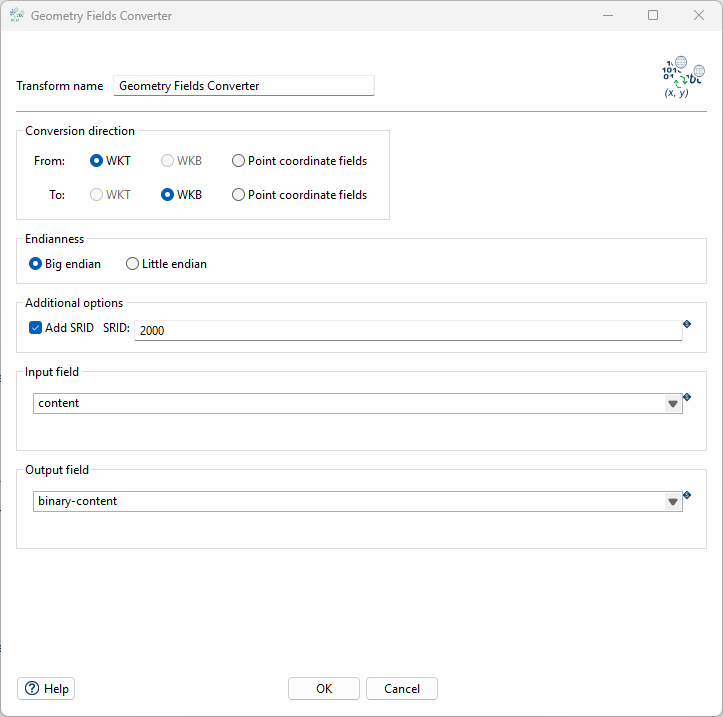

# Apache Hop-Plugin Geometry Fields Converter

## Description

This plugin allows you to convert geometries into the well-known text, well-known binary and point coordinates formats in [Apache Hop]([https://hop.apache.org/) via a Transform.




## Installation

Simply download the ZIP file from the [latest release](https://gitlab.ost.ch/apache-hop-plugin-sa/apache-hop-plugins-geometry-fields-converter/-/releases/permalink/latest), extract it, and move the resulting folder (including all its contents) into your hop/plugins/transforms directory.

```bash
hop
└── plugins
    └── transforms
        └── geometryfieldsconverter
            ├── hop-transform-geometryfieldsconverter-version.jar
            ├── lib
            │   ├── dependencies.jar
            │   └── moredependencies.jar
            └── version.xml
```

### Manual Building

**Pre-requisites for building the project:**

* Maven, version 3+
* Java JDK 11
* IntelliJ

Download the source code and checkout into the folder.

```bash
git clone https://gitlab.ost.ch/apache-hop-plugin-sa/apache-hop-plugins-geometry-fields-converter.git
cd apache-hop-plugins-geometry-fields-converter
```

**Configure the plugin installation path:**

In the [pom.xml](./pom.xml),set the ```<hop.plugins.dir>``` property to the target directory inside your Hop installation where the plugin should be installed. \
For example: ```<hop.plugins.dir>C:\Users\user\Program Files\hop\plugins\transforms\geometryfieldsconverter</hop.plugins.dir>```. \
Doing this will automatically update the plugin in Hop after each build.

**Build the plugin:**

Run the following Maven command to clean, build, test, and install/update the plugin.

```bash
mvn clean package
```

### Updating

To update the plugin, simply repeat the steps of the installation with the ZIP file from the new version. Make sure to overwrite existing files.

## Usage

Use examples liberally, and show the expected output if you can. It's helpful to have inline the smallest example of usage that you can demonstrate, while providing links to more sophisticated examples if they are too long to reasonably include in the README.

## Code Formatting

The code follows the official [Google Java Style Guide](https://google.github.io/styleguide/javaguide.html), which is enforced by the provided [IntelliJ formatting plugin](https://plugins.jetbrains.com/plugin/8527-google-java-format) and the Maven Spotless plugin. Formatting compliance can be verified using ```mvn spotless:check```, and formatting can be applied automatically using ```mvn spotless:apply```.

## Dependencies and Plugins

The following dependencies and Plugins were used throughout this project:

* [The JTS Topology Suite](https://github.com/locationtech/jts)
* [Hop Group](https://mvnrepository.com/artifact/org.apache.hop) (Core, Engine, UI)
* [JUnit](https://mvnrepository.com/artifact/junit/junit)
* [spotless](https://github.com/diffplug/spotless/tree/main)
* [Apache Maven Dependency Plugin](https://mvnrepository.com/artifact/org.apache.maven.plugins/maven-dependency-plugin)
* [Jandex](https://github.com/smallrye/jandex)
* [google-java-format](https://plugins.jetbrains.com/plugin/8527-google-java-format)

## CI/CD Pipeline

## License

This project is licensed under the Apache License, Version 2.0 (the "License"); you may not use this file except in compliance with the License. You may obtain a copy of the License at:

http://www.apache.org/licenses/LICENSE-2.0

Unless required by applicable law or agreed to in writing, software distributed under the License is distributed on an "AS IS" BASIS, WITHOUT WARRANTIES OR CONDITIONS OF ANY KIND, either express or implied. See the License for the specific language governing permissions and limitations under the License.
