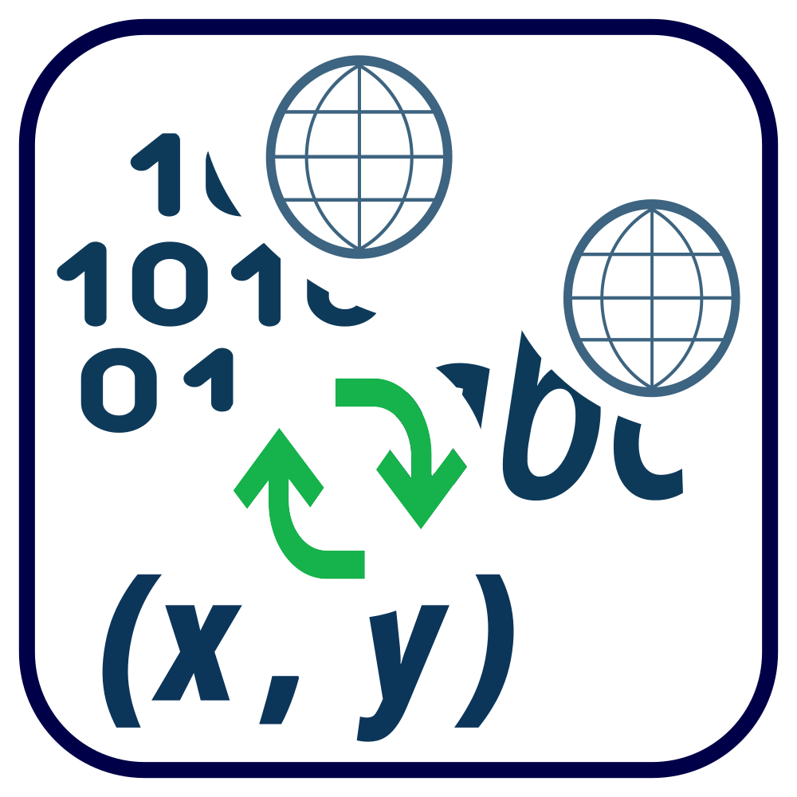
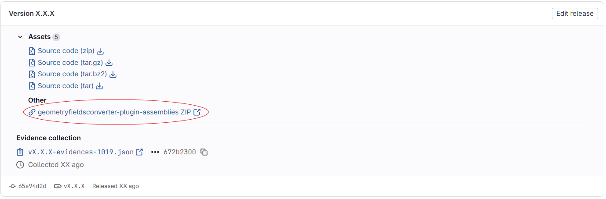
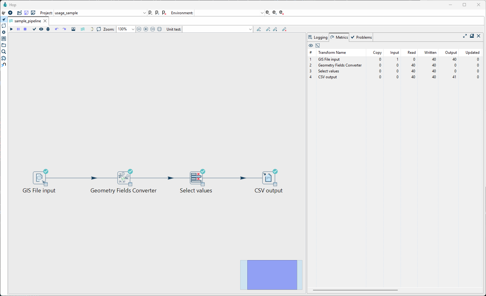
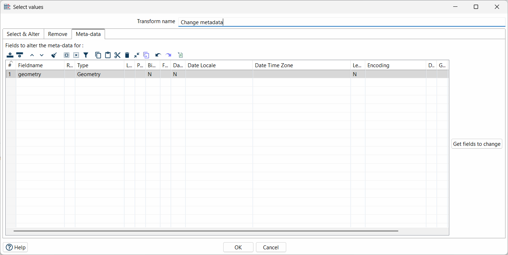

# Apache Hop-Plugin Geometry Fields Converter



## Description

The Geometry Fields Converter users to convert geometries into Well-Known Text (WKT), Well-Known Binary (WKB), and point coordinate formats and back in [Apache Hop]([https://hop.apache.org/) via a Transform.
This enables users to perform geospatial operations using the [Hop GIS Plugins by Atol CD](https://github.com/atolcd/hop-gis-plugins/tree/master) without having to work directly with GIS files.
The Transform treats fields of the type ``Geometry`` as WKT. \
This plugin was developed and tested for Apache Hop version 2.16.


## Installation 

Simply download the ZIP file from the [latest release](https://gitlab.ost.ch/apache-hop-plugin-sa/apache-hop-plugins-geometry-fields-converter/-/releases/permalink/latest), extract it, and move the resulting folder (including all its contents) into your hop/plugins/transforms directory.



```console
hop
└── plugins
    └── transforms
        └── geometryfieldsconverter
            ├── hop-transform-geometryfieldsconverter-version.jar
            ├── lib
            │   └── jts-core-1.20.0.jar
            └── version.xml
```

### Manual Building

**Pre-requisites for building the project:**

* Maven, version 3+
* Java JDK 11
* IntelliJ

Download the source code and checkout into the folder.

```bash
git clone https://gitlab.ost.ch/apache-hop-plugin-sa/apache-hop-plugins-geometry-fields-converter.git
cd apache-hop-plugins-geometry-fields-converter
```

**Configure the plugin installation path:**

In the [pom.xml](./pom.xml), set the ``<hop.plugins.dir>`` property to the target directory inside your Hop installation where the plugin should be installed. \
For example: ``<hop.plugins.dir>C:\Users\user\Program Files\hop\plugins\transforms\geometryfieldsconverter</hop.plugins.dir>``. \
Doing this will automatically update the plugin in Hop after each build.

**Build the plugin:**

Run the following Maven command to clean, build, test, and install/update the plugin.

```bash
mvn clean package
```

### Updating

To update the plugin, simply repeat the steps of the installation with the ZIP file from the new version. Make sure to overwrite existing files.

## Usage

``usage_sample/`` contains a small Hop project with a pipeline that demonstrates a sample use case of converting the geometries of castles in Switzerland ([extracted via an overpass query](https://overpass-turbo.eu/)) in a GeoJSON to point coordinate fields. After importing the CSV file, the geometry field is converted into point coordinate fields, then the original geometry field is removed and the result is saved in a CSV file. \
**The pipeline uses a Transform from the [Hop GIS Plugins by Atol CD](https://github.com/atolcd/hop-gis-plugins/tree/master). This plugin must be installed for the pipeline to be able to be opened and properly run!**



| Setting              | Description                                                                                                                                                                                                                                                                                                                                                                                                                                                                                                                                                                                                                   |
|----------------------|-------------------------------------------------------------------------------------------------------------------------------------------------------------------------------------------------------------------------------------------------------------------------------------------------------------------------------------------------------------------------------------------------------------------------------------------------------------------------------------------------------------------------------------------------------------------------------------------------------------------------------|
| Conversion direction | ``From`` defines the format of the input field(s). The user must ensure that the input data is correct; otherwise the pipeline will fail. ``To`` defines the desired output format.                                                                                                                                                                                                                                                                                                                                                                                                                                           |
| Endianness           | In case ``WKB`` is selected as the output format, the user can choose the byte order of the generated binary. ``Big endian`` is the default.                                                                                                                                                                                                                                                                                                                                                                                                                                                                                  |
| Additional options   | Currently, only the option to add an SRID is available. This option is only enabled if the output format is either Well-Known Text or Well-Known Binary. If the input already contains an SRID, it will be overwritten, and the user will be notified via a log entry (visible in the Logging tab).                                                                                                                                                                                                                                                                                                                           |
| Input field(s)       | The user must define the field that will be converted. If point coordinate fields are selected as input format, a second field containing the y-coordinate must be specified. The dropdown menu shows all fields provided by the previous Transform (if connected via a Hop).                                                                                                                                                                                                                                                                                                                                                 |
| Output field(s)      | The user may define the field in which the converted value will be stored. If the input format is point Coordinate Fields, a second output field may be specified. The fields may also be left empty, in which case new fields will be created according to the output format (``WKT``->``geometry_wkt``, ``WKB``->``geometry_wkb``, ``Point coordinate fields``->``longitude``,``latitude``). The user may also define new fields by choosing unique names. A dropdown menu is available showing all fields from the previous Transform. Selecting an existing field as output will overwrite the field and change the type. |

### Behaviour

The user is responsible for ensuring that all input field values are valid; otherwise, the pipeline will fail.

**Empty Values:** If the input field (both input fields for point coordinates) in the current row are empty (``<null>``), the output will be empty as well. For point coordinates, both input fields must be empty; otherwise, an error is raised and the pipeline will fail.

**Point Coordinates:** Both input fields must be of a numeric type (``BigNumber``, ``Integer`` or ``Number``).

**SRID:** SRID handling is implicit. Any pre-existing SRID is retained in any case. If a new SRID is specified, the existing SRID is overwritten and the change is logged. The geometry is not reprojected, and the SRID value is not validated.

**Well-Known Binary:** When WKB is selected as the output format, the resulting geometry is stored as a hexadecimal value in a ``Binary`` field.

### Compatibility with Atol CD Hop GIS Plugins

Currently, WKT geometries are saved as String fields in Hop, however GIS operation Transforms from Atol CD require a Geometry field type. \
To circumvent this, the WKT field has to have their metadata type changed to a geometry type via the Select Value Transform.



## Software Architecture

[Apache Hop's official plugin sample](https://github.com/project-hop/hop-plugin-sample) forms the basis for this repository, using the ``hop-transform-sample`` skeleton. The plugin follows the basic architectural definitions set by existing Apache Hop plugins.

### Classes

#### GeometryFieldsConverter

Contains the business logic of the Transform.
Upon processing the first row, it attempts to initialise the indexes for the input and output fields.
The actual transformation is performed by converting the input into a JTS geometry and then into the desired output format.

#### Data Class

The Data class contains the field information for the input and output rows of the Transform, mainly the indexes of the input and output field(s) and their field types.

#### Meta Class

Contains all relevant properties for the Transform, ranging from formats to field names and settings. The most important function here is ``getFields()``, which is responsible for creating the output row.

#### Dialog Class

The Dialog class defines the GUI of the Transform using the SWT library.
Of particular importance are the ``getInfo()`` function, which sets all Transform data in the Meta class, and the ``getData()``function, which maps the stored values from the Meta class to the Dialog when the window is opened.

#### Geometry Format Enums

Defines the supported format types (``WKB``, ``WKT`` and ``POINT_COORDINATE``). This allows for the easy addition of further formats.

### Folder Structure

```bash
├───integration_test # Hop files and sample data to perform an integration test
├───resources # Images used in this readme
├───speed_test # Hop files and sample data to perform a speed test
├───src
│   ├───main/java/ch/ost/hop/pipeline/transforms/geometryfieldsconverter # Java source code
│   │   └───resources/ch/ost/hop/pipeline/transforms/geometryfieldsconverter/messages # Localisation messages
│   └───test/java/ch/ost/hop/pipeline/transforms/geometryfieldsconverter # Java unit tests
└───usage_sample # Hop files and data for the example
```

## Code Formatting

The code follows the official [Google Java Style Guide](https://google.github.io/styleguide/javaguide.html), which is enforced by the provided [IntelliJ formatting plugin](https://plugins.jetbrains.com/plugin/8527-google-java-format) and the Maven Spotless plugin. Formatting compliance can be verified using ``mvn spotless:check``, and formatting can be applied automatically using ``mvn spotless:apply``.

## Dependencies and Plugins

The following dependencies and Plugins were used throughout this project:

* [The JTS Topology Suite](https://github.com/locationtech/jts)
* [Hop Group](https://mvnrepository.com/artifact/org.apache.hop) (Core, Engine, UI)
* [JUnit](https://mvnrepository.com/artifact/junit/junit)
* [spotless](https://mvnrepository.com/artifact/com.diffplug.spotless/spotless-maven-plugin)
* [Apache Maven Dependency Plugin](https://mvnrepository.com/artifact/org.apache.maven.plugins/maven-dependency-plugin)
* [Jandex](https://github.com/smallrye/jandex)
* [google-java-format](https://plugins.jetbrains.com/plugin/8527-google-java-format)

## CI/CD Pipeline

A basic CI/CD pipeline is defined inside the [gitlab yml](.gitlab-ci.yml) file, with the following stages and jobs:

### build

* **check_formatting:** \
  Checks formatting via the ``mvn spotless:check`` command.
* **build:** \
  Builds the project via the ``mvn clean package`` command and moves all resulting artefacts into the ``targers/`` directory.

### test

* **code_quality:** \
Run the [code quality template job](https://docs.gitlab.com/ci/testing/code_quality/), performing a basic code review, as a prerequisite for merge requests.
* **integration_test:** \
Run the [Hop Pipeline](https://gitlab.ost.ch/apache-hop-plugin-sa/apache-hop-plugins-geometry-fields-converter/-/blob/main/integration_test/pipeline.hpl) inside ``integration_test/`` that performs two basic geometry fields conversions to check the integrity of the Plugin. \
In case the type name of the Transform or the metadata changes, the pipeline has to be manually adjusted.
* **semgrep-sast:** \
Run the [static application security testing (SAST) template job](https://docs.gitlab.com/user/application_security/sast/), performing a security scan on the repository.
* **unit_test:** \
Run the [JUnit tests](https://gitlab.ost.ch/apache-hop-plugin-sa/apache-hop-plugins-geometry-fields-converter/-/blob/main/src/test/java/ch/ost/hop/pipeline/transforms/geometryfieldsconverter/GeometryFieldsConverterTests.java).
* **speed_test:** \
Run the [speed test Hop Pipeline](https://gitlab.ost.ch/apache-hop-plugin-sa/apache-hop-plugins-geometry-fields-converter/-/blob/main/speed_test/speed_test.hpl) inside ``speed_test/``, whose performance metrics get logged via the ``log_pipeline.hpl``, in a JSON file
* **evaluate_performance:** \
Calculate the speed per row with the prior JSON file and evaluate the resulting performance via a simple bash script.

### release

* **prepare_release:** \
This job only runs once a new tag is created. It creates a ZIP archive containing all necessary files for installation. This ZIP file is made available as a release.

## Language Support

This plugin supports French, German, and English languages.
The localisation files containing the messages are located in the [``src/main/resources/ch/ost/hop/pipeline/transforms/geometryfieldsconverter/messages``](https://gitlab.ost.ch/apache-hop-plugin-sa/apache-hop-plugins-geometry-fields-converter/-/tree/24d2ac3cefbd886b67c2e2cee6dc0fb40e14f1f5/src/main/resources/ch/ost/hop/pipeline/transforms/geometryfieldsconverter/messages) directory.
Adding a new language is done by creating an additional file following the naming scheme ``[messages_xx_XX.properties]`` and translating all messages accordingly.
It is important to note that these files are not UTF-8 encoded, but use ISO-8859-1 (Latin-1).
Therefore, characters not contained in Latin-1 must be escaped using their Unicode notation (``\uXXXX``).

## Licence

This project is licensed under the Apache License, Version 2.0 (the "License"); you may not use this file except in compliance with the License. You may obtain a copy of the License at:

<http://www.apache.org/licenses/LICENSE-2.0>

Unless required by applicable law or agreed to in writing, software distributed under the License is distributed on an "AS IS" BASIS, WITHOUT WARRANTIES OR CONDITIONS OF ANY KIND, either express or implied. See the License for the specific language governing permissions and limitations under the License.
